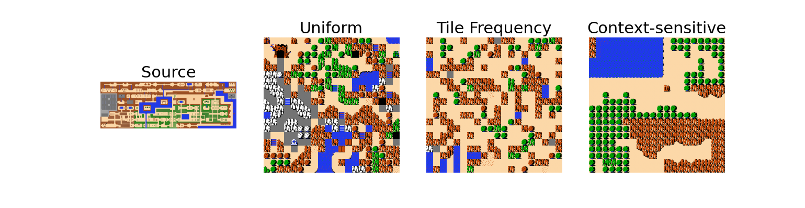

# Context-sensitive WFC

This is the code for the "Better Resemblance without Bigger Patterns: Making Context-sensitive Decisions in WFC" paper by Bahar Bateni, Isaac Karth and Adam Smith. The paper was published at FDG 2023 and is available at https://dl.acm.org/doi/10.1145/3582437.3582441.

<p align="center"></p>
<p align="center">
  
  
  
</p>

The paper proposes a small and easy to implement modification to the WaveFunctionCollapse algorithm which significantly improves the quality fo results.

WaveFunctionCollapse (WFC) is a Procedural Content Generation algorithm which generates an image similar to some input image. The input image is broken into tiles or patterns which can be composed by the algorithm to create a new image. A set of constraints extracted from the input are satisfied during the process which results in the similarity between the input and output. For more information about the WFC algorithm refer to https://github.com/mxgmn/WaveFunctionCollapse.

For more information about this modification refer to the paper. To run this code, refer to the [How to Run](#how-to-run) section. If you want to implement the context sensitive heuristic in your own work, refer to the [Porting Context-sensitive Heuristic](#porting-context-sensitive-heuristic) section.
To use an interactive tool and get some outputs, use the colab notebook available at [TODO add link].

## How to Run

### Requirements

The list of requirements are available in the `requirements.txt` file. You can install these requirements with `pip` by using:

```bash
pip install -r requirements.txt
```

It is suggested to use a virtual environment when installing the requirements. You can use virtualenv by running:

```bash
pip install virtualenv
virtualenv venv
[windows] venv\Scripts\activate
[linux] source venv/bin/activate
pip install -r requirements.txt
```

To learn more, refer to virtualenv documents.

### Running WFC

You can run the WFC algorithm by running the main script:

```bash
python main.py
```

This would results in generating one output per each of the *Decision Heuristic*s for the zelda example.
The result will differ each time. To get the same results everytime, change the `GLOBAL_HASH_TYPE` in the `utility.py` file:

```python
GLOBAL_HASH_TYPE = HASH_TYPE.NUMBER_HASH
```

This will run a deterministic hashing algorithm which is significantly slower than the other implementation, but will remove the randomness and generate the same output
every time the algorithm is executed with the same seed.

### Available Options

The following options are available in the `main.py` file to get the desired outputs. The examples in the `main.py` file show how the same code can be used for bigger patterns,
as well as visualizing those patterns.

- `backtrack=False` shows if backtracking will be used for satisfying all the constraints. The default value is `False`, meaning that when there are no possible options for
a tile, that tile can be left blank (showing as a white tile). By using `backtrack=True` the execution time will significantly increase based on how limiting the constraints
are, but the algorithm will fill all the tile positions with valid tiles.
- `weighting_option` is the heuristic which gives weights to each tile option in the *Decicion* process. For more information refer to the
[Decition Heuristic](#decision-heuristics) section.
- `entropy_option` is the heuristic which gives entropy values to each position in the *Selection* process. For more information refer to the
[Selection Heuristic](#selection-heuristics) section.

## Overview

### WFC's main loop

The main loop of WFC does the following:

1. Start with an empty grid of the desired size
2. Iteratively, while an empty position exists on the grid:
    1. Select an empty position on the grid (sometimes refered to as the *Selection Heuristic*)
    2. Decide which one of the **valid** tiles to put in the target position (refered to as the *Decision Process*). By deciding this tile, we say that the wave function for this position has collapsed to one single tile value.
    3. Update the set of **valid** tiles. Collapsing one position may eliminiate some of the options at other positions based on the constraints.
3. Once all positions have been filled with tiles, the output has been generated and the algorithm terminates.

A tile is considered **valid** for a position if the tile is not resulting in contradiction with the available constraints. These constraints decide which pair of tiles can
appear as neighbors in the output based on if the same pair have appeared as neighbors in the input. For instance, if tile A have never been an immediate
neighbor above tile B in the input, then tile B can't be chosen for a position that has A immediately above it in the output.

### Selection Heuristics

As mentioned above, *Selection Heuristic* is the process in which an empty position on the output grid is selected to be filled with a tile.
Different *Selection Heuristic*s have been implemented in this project, and can be selected by changing the `entropy_option` argument. Please note that
even though changing the *Selection Heuristic*s can change the quality of the result, the paper is focused on the effect of the *Decision Heurisitic*.

The following options are available for the *Selection Heuristic*:

1. `TOP_LEFT` starts by selecting the top-left corner tile, then row by row (left to right) until the bottom-right corner tile.
2. `TOP_RIGHT` starts by selecting the top-right corner tile, then row by row (right to left) until the bottom-left corner tile.
The reason to have this heuristic is for comparison with the previous one and showing the bias these two heuristics are causing.
3. `NUMBER_OF_OPTIONS` selects the position with minimum number of options at each step.
4. `SHANNON` uses shannon entropy to calculate the entropy of each position and chooses the position with minimum entropy.
Note that the shannon entropy is defined based on the probability of each option, which means that the *Decision Heuristic*, which defines this probability,
will also affect the *Selection* process. For example, when the *Decision Heuristic* is set to `Uniform`, `SHANNON` option will be the same as `NUMBER_OF_OPTIONS`.

For visualizing the *Selection Heuristic*s side-by-side, `visualize_wfc_selection_heuristics` function in the `main.py` file can be used. An example of this generated with the `CONTEXT_SENSITIVE` *Decision Heuristic* on zelda example is shown below:

<p align="center"></p>

As you can see, using the `TOP_LEFT` and `TOP_RIGHT` option results in some diagonal pattern artifacts in the output.

### Decision Heuristics

The *Decision Heuristic* is the process which decides which one of the **valid** tiles to use for some target position.
The heuristic assigns probabilities to **valid** tile options and then samples these probabilities. The following *Decision Heuristic*s are available in this implementation:

1. `UNIFORM` uses a uniform probability distribution for the tile options. In other words, it chooses one of the **valid** options randomly.
2. `TILE_FREQUENCY` uses the frequency of tiles to assign probability to options. The frequency for each tile is the number of times that tile have
appeared in the input. The probability of each option is its frequency devided by sum of all the frequencies for all **valid** options.
3. `CONTEXT_SENSITIVE` uses the frequency of tiles in the same **context** to assign the probability of options. We define **context** as a tuple of tiles adjacent to
the target tile (which is a tuple of 4 tiles in this 2D implementation). Basically, for the target position, we first extract the context around it (for any tile which haven't
been decided yet or which is out of bound, a special unknown toke is used which is shown by `None` in this implementation). Then we access a lookup table to get the
frequency of each of the tile options in the same context in the input. We then devide this frequency by sum of the same frequencies for all the options to get a probability.
If the context is new to us, we use the general frequency of tile in a completely unknown context, which is the same as `TILE_FREQUENCY` option.

For visualizing the *Decision Heuristic*s side-by-side, `visualize_wfc_decision_heuristics` function in the `main.py` file can be used. An example of this generated with the `NUMBER_OF_OPTIONS` *Selection Heuristic* on zelda example is shown below:

<p align="center"></p>

## Implementaiton Details

This implementation contains the following files:

1. `image.py` defines an image unit as a 2D array of pixels which can be converted into a single number with the `_get_number` function.
In this README file we refer to image unit as tile, but it can be any unit of image we assign to positions on the image.
Some example of this unit which are implemented in here are `Tile`, and two bigger `Pattern`s called `nxmPattern` and `UpLeftLPattern`.
The `nxmPattern` is a rectangular pattern with the shape n by m (nxm tiles in total).
The `UpLeftLPattern` is a L shaped pattern containing a center tile, n tiles above it, and m tiles left of it (n+m+1 tiles in total).
New patterns can be easily defined by listing the set of tiles in the pattern as relative indices to a center tile.
2. `tiled_image.py` defines a process of extracting the image units from an image. The image contains a 2D array of numbers representing tiles at each position of the input, and a one-to-one mapping from number to tile.
3. `image_distribution` defines the `ImageDistribution` class which extracts the frequency of tiles, frequency of tile pairs, and frequency of tiles in different contexts.
It also extracts the valid tile pairs. The `ImageDistribution` class represents the training data of WFC and can be trained on as many `TiledImage` objects as desired.
4. `WFC.py` is the WFC implemetation containing different heuristics. For more details about how this is implemented, refer to the [WFC Implementation](#wfc-implementation) subsection.
5. `utility.py` contains some utility functions used by other files.

### WFC Implementation

As mentioned above, the core loop of WFC is implemented in the `WFC.py` file. This core loop uses a supermap to run the WFC. Supermap is a 2D map representing the output.
Each position (i, j) in the supermap (i.e. `supermap[i, j]`) is a list of possible **valid** options available for the position (i, j). If only one option is available at some position, that position have already collapsed. If all positions have only one option each, the output is ready. If at some position there are no options available, depending on the `backtrack` paramter it either returns None for that position or uses backtracking to revert steps and try other options.

Each option is a single number which represents a tile or a pattern. The one-to-one mapping from this number to pixel values is in the `TiledImage` object, and WFC only works with the number representing that option. To get the final pixel values, the result of `WFC.generate` function should be passed to `TiledImage.from_generated` function.

The WFC object is initiated based on a `ImageDistribution` object which represents its training data. The same `WFC` object can then be used as many times as desired to
generate outputs with different heuristics, with or without backtraking, and with different sizes.

### Selection Heuristics Implementation

The *Selection Heuristic* is implemented in a single function in the `WFC.py` file called `_get_entropy`. Given the supermap, x, y, and output size, this function returns the entropy of position (x, y) of supermap. The entropy can be any number, and the WFC algorithm will select the empty position with minimum entropy at each step to collapse.

For instance, the `TOP_LEFT` entropy option returns `i*n+j` as entropy of position (i, j), with n being the number of columns. This means that an empty position of (i, j)
is prioritized over positions (i + 1, j) and (i, j + 1). The `NUMBER_OF_OPTIONS` entropy option returns the number of options at position (i, j), which is the length of 
`supermap[i, j]`.

To add a new *Selection Heuristic*, simply add your heuristic name as an `EntropyOptions` in `WFC.py`. Then add an if statement in the `_get_entropy` function to reutrn the
entropy value for a given position. If you want to change how this entropy is used, for example using the maximum entropy position instead of minimum entropy, you
can change the `_get_position_to_collapse` function in `WFC.py`.

### Decision Heuristics Implementation

The *Decision Heuristic* is implemented in a single function in the `WFC.py` file called `_get_weights`. Given the supermap, x and y, this function returns a list of 
weights for position (x, y). This list should have the same length as `supermap[x, y]`, because it represents the weight of each option at position (x, y).
The WFC algorithm will then convert these weights to probabilities by deviding them by their sum. This probability will then be sampled to decide a single tile
for position (i, j). This probability will also be used in calculating the entropy if the `SHANNON` entropy option is selected.

For instance, the `UNIFORM` weighting option, which samples the uniform distribution, is implemented by returning an array of 1s with the same lenght as `supermap[i, j]`. The
`TILE_FREQUENCY` option returns the frequency of each tile in `supermap[i, j]`. The frequency can be accessed via `ImageDistribution` object
trained on the input images available at `self.dist`.

To add a new *Decision Heuristic*, add your heuristic name as an `WeightingOptions` in `WFC.py`. Then add an if statement in the `_get_weights` function to return the
weight values for a given position. The weight values should be positive numbers, but there are not other requirements. The weights will be automatically normalized to
probability values in the `_get_probabilities` function. The WFC then samples this probability to select a single tile in the `_collapse` function.

## Porting Context-sensitive Heuristic

The Context-sensitive heuristic is implemented in two main parts:

1. Pre-process to count the frequency of each tile in each context and storing these values in a lookup table. This process should be done once before running the WFC function. The same lookup table can then be used in generating as many outputs as desired without any change to the table.
2. Calculate the context-sensitive heuristic in the main loop of WFC. This is done by finding the context around target tile position, and then looking up
the frequency of (x, context) for each option x of the available tile options at the target position. For more information refer to the steps below.

### Pre-processing

In the preprocessing of WFC, we have a set of inputs as tile numbers on a grid. The valid tile adjacencies are infered by looking at adjacent tiles on this grid.
To add the context-sensitive heuristic, in the same pre-processing step we calculate a lookup table for frequency of tiles in different context.

#### Step 1: Define Context

We define the context around some tile as an array or tuple of its neighbors. In 2D, this means that the context around position (x, y) is defined as:

```python
# target position (x, y)
def get_context(tiles, x, y):
    return (tiles[x+1, y], tiles[x, y+1], tiles[x-1, y], tiles[x, y-1])
```

In M dimentional environment, this would be a tuple of 2M tiles. The context object should have the same order for each adjacent tile (e.g. tile above always as the first
tile in context).

If any of the the tiles in the context is outside the boundary of the input, we use a special unknown (`UNK`) token to represent that tile.
For example the context around tile (0, 0) would be:

```python
# target (0, 0)
context = (tiles[1, 0], tiles[0, 1], UNK, UNK)
```

#### Step 2: Define Partial Context List

In WFC's main loop, in most cases the full context of our target tile is not available. As the output is being generated, target points are selected in positions that
may have some of their adjacent tiles still empty (in super-position, not collapsed yet). It also might happen that some of the adjacent tiles are out of bounds.
Because of that, we have to also populate these partial context in our lookup table. We define the list of partial context around position (x, y) as:

```python
# target position (x, y)
def get_partial_context_list(tiles, x, y):
    N_1, N_2, N_3, N_4 = tiles[x+1, y], tiles[x, y+1], tiles[x-1, y], tiles[x, y-1]
    return [
        (UNK, UNK, UNK, UNK),
        (N_1, UNK, UNK, UNK),
        (UNK, N_2, UNK, UNK),
        (UNK, UNK, N_3, UNK),
        (UNK, UNK, UNK, N_4),
        (N_1, N_2, UNK, UNK),
        (N_1, UNK, N_3, UNK),
        (N_1, UNK, UNK, N_4),
        (UNK, N_2, N_3, UNK),
        (UNK, N_2, UNK, N_4),
        (UNK, UNK, N_3, N_4),
        (N_1, N_2, N_3, UNK),
        (N_1, N_2, UNK, N_4),
        (N_1, UNK, N_3, N_4),
        (UNK, N_2, N_3, N_4),
        (N_1, N_2, N_3, N_4),
    ]
```

Please note that it should be considered that some of these context might be empty. In that case, the duplicates context keys in the context list should be eliminated.
As an example, if the target position is at (0, 0):

```python
# target (0, 0)
N_1, N_2 = tiles[x+1, y], tiles[x, y+1]
partial_context_list = [
    (UNK, UNK, UNK, UNK)
    (N_1, UNK, UNK, UNK)
    (UNK, N_2, UNK, UNK)
    (N_1, N_2, UNK, UNK)
]
```

#### Step 3: Context Frequency Lookup Table

We define a lookup table for our context frequencies. This lookup table is populated as follows:

For each position (x, y) of some input, with tile value `T`:
1. Find the list of partial context around position (x, y)
2. For each partial context `C` in this list, we increase the frequency of key = (T, C). If the key doesn't exist, we add it to the lookup table with frequency 1.

```python
# target position (x, y)
T = tiles[x, y]
partial_context_list = get_partial_context_list(tiles, x, y)
for C in partial_context_list:
    table[(T, C)] += 1
```

### Heuristic Implementation

#### Step 4: Use the frequency values

In the decision process, we have a target position (x, y), and a list of valid options for that position. These options have been filtered to guarantee
satisfying the constraints.

To choose one of these tiles, in context-sensitive heuristic we sample a probability distribution calculated by the frequency of context keys for each option.

```python
# target position (x, y)
def decide_tile(output_tiles, x, y)
    C = get_context(output_tiles, x, y)
    weights = [table[(T, C)] for T in options]
    probabilities = weights / sum(weights)
    return choose(options, probabilities)
```

## References

- The paper is available at https://dl.acm.org/doi/10.1145/3582437.3582441
- WFC was intially introduced by Maxim Gumin, and the implementation is availabe at https://github.com/mxgmn/WaveFunctionCollapse. The repository also contains a list of
implementations in other programming languages.
- The Zelda map image available in this repository is from https://nesmaps.com/maps/Zelda/ZeldaOverworldQ1BG.html

## TODO list

The following features have been implemetned but are not part of this repository yet:

- Interactive WFC notebook
- Resemblance Metrics
- 3D WFC: my implementation also contains the code to read/write minecraft data as an exmaple of this
<p align="center">
  
  
  
</p>

- M Dimensional Implementation: my implementation for M dimensions is a bit complicated and harder to read than the 2D implementation. While very similar, the 2D implementation is a lot easier to understand because it doesn't use any fancy functions. For example it uses a nested `for` loop instead of an `ndenumerate` loop.
- Expressive Range Analysis

If you think some other features should be added here or some bugs should be fixed, please submit an issue.

Alternatively if you have already implemented some features or fixed something that you want to add to the repository, please submit a pull request.

If you want to talk about this, feel free to contact me by emailing me at bbateni@ucsc.edu.

## Future Work

Possible areas of investigation:

- What is the effect of changing the context definition?
- How can we implement this for a WFC on a graph?
- Can we further improve the resemblance by modifying the selection heuristic?

## FAQ

**Some tiles in the output are blank (completely white). What's wrong?**

This is because the algorithm can't find any valid tiles for those positions. Try running the algorithm with backtracking by setting `backtrack=True`. This will increase the
exection time but will search all the available options to get a valid result. If there are no valid results available, the code will return a `Not possible` exception.

**There are some artifact in the results: there is a diagonal pattern seen in the outputs. What should I do?**

This shows some bias in the output, which can be a result of selection heuristic. Changing the selection heuristic to `SHANNON` or `NUMBER_OF_OPTIONS` will resolve this problem.

**Running the WFC algorithm with the same seed results in different values. How can I solve this?**

The reason is that the main process which turns a tile to a number uses the python hash function. The python hash function is undeterministic and changes every time you run the program because of security reasons. To change this, you can change hash method by changing
```python
GLOBAL_HASH_TYPE = HASH_TYPE.PYTHON_HASH
```
to
```python
GLOBAL_HASH_TYPE = HASH_TYPE.NUMBER_HASH
```
in the `utility.py` file. The `NUMBER_HASH` hashing method is deterministic, but will make the tile extraction process significantly slower, but doesn't have any impact on the execution time of other parts such as the WFC algorithm.
